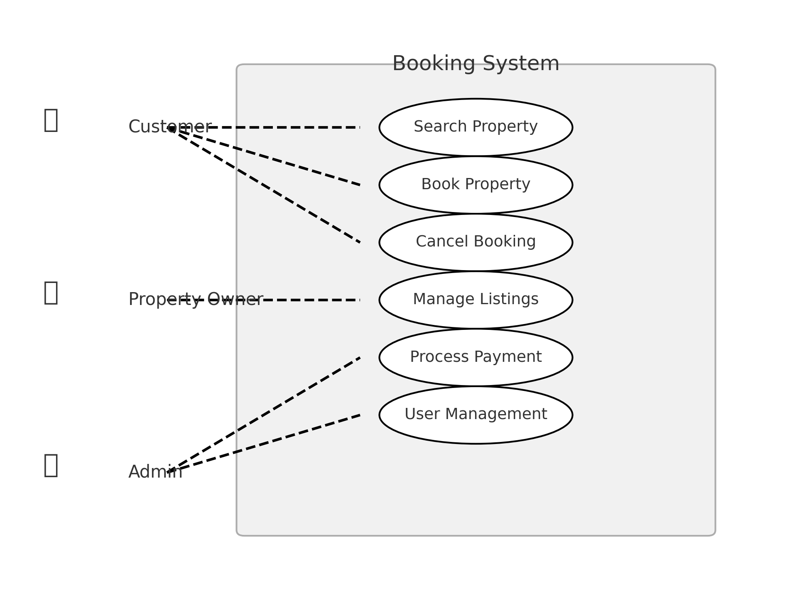

# requirement-analysis
# Requirement Analysis in Software Development
## Introduction
This repository is dedicated to **Requirement Analysis** in software development. It covers key concepts, methodologies, and best practices for gathering, documenting, and validating software requirements. The goal is to provide a structured approach to ensure clarity and alignment between stakeholders and development teams.

## What is Requirement Analysis?

Requirement Analysis is a critical phase in the **Software Development Lifecycle (SDLC)** where the needs, expectations, and constraints of stakeholders are gathered, analyzed, and documented. It ensures that the final software product aligns with business goals and user requirements.

### Importance of Requirement Analysis:
- **Defines Scope:** Helps in clearly defining what the software should and shouldn’t do.
- **Prevents Scope Creep:** Identifies essential features and prioritizes them to avoid unnecessary additions later.
- **Improves Development Efficiency:** Provides a clear roadmap for developers, reducing misinterpretations and rework.
- **Enhances Software Quality:** Ensures the system meets functional and non-functional requirements like security, performance, and usability.
- **Facilitates Stakeholder Communication:** Bridges the gap between business teams and technical teams for better alignment.

By conducting a thorough Requirement Analysis, organizations can minimize risks, save time, and develop software that meets user expectations effectively.
## Why is Requirement Analysis Important?

Requirement Analysis is a crucial step in the **Software Development Lifecycle (SDLC)** that ensures the project is built correctly from the start. It plays a key role in delivering high-quality software that meets user expectations and business needs.

### Key Reasons for its Importance:

1. **Prevents Miscommunication and Reduces Errors**  
   Properly documenting requirements minimizes misunderstandings between stakeholders, developers, and testers, reducing costly rework and project delays.

2. **Enhances Project Planning and Resource Allocation**  
   A well-defined set of requirements helps project managers allocate resources effectively, estimate costs accurately, and set realistic timelines.

3. **Improves Software Quality and User Satisfaction**  
   By analyzing and validating requirements early, teams can ensure that the final product meets both functional and non-functional expectations, leading to better usability and performance.

By prioritizing Requirement Analysis, organizations can avoid project failures, stay within budget, and deliver software that aligns with business objectives.
## Key Activities in Requirement Analysis

Requirement Analysis involves several structured activities to ensure that the software meets stakeholder expectations and business objectives. Below are the five key activities:

- **Requirement Gathering**  
  Collecting high-level requirements from stakeholders through meetings, surveys, and research to understand project goals.

- **Requirement Elicitation**  
  Extracting detailed requirements using techniques like interviews, brainstorming, use case analysis, and prototyping.

- **Requirement Documentation**  
  Clearly defining and documenting requirements in formats such as Software Requirement Specifications (SRS), use case diagrams, and user stories.

- **Requirement Analysis and Modeling**  
  Evaluating and structuring requirements using models like flowcharts, data flow diagrams (DFD), and entity-relationship diagrams (ERD) to ensure feasibility and consistency.

- **Requirement Validation**  
  Reviewing and verifying requirements with stakeholders through walkthroughs, prototyping, and feedback sessions to ensure accuracy and completeness.

Each of these activities plays a vital role in defining and refining requirements, ultimately leading to the successful development of software.
## Types of Requirements

Requirements in software development are broadly classified into **Functional Requirements** and **Non-functional Requirements**. Below is a detailed differentiation with examples related to a **Booking Management System**.

### 1. Functional Requirements
Functional requirements define the specific behaviors, features, and functionalities the system must perform.

**Examples for a Booking Management System:**
- Users must be able to **search for available properties** based on location, date, and price range.
- The system should allow **users to book a property** and receive a confirmation email.
- Property owners should be able to **list their properties** with details like price, location, and availability.
- Users must be able to **cancel or modify their bookings** before the check-in date.
- Secure **user authentication and login** must be implemented for customers and administrators.

### 2. Non-functional Requirements
Non-functional requirements define how the system should perform rather than what it should do. They focus on quality attributes like performance, security, and usability.

**Examples for a Booking Management System:**
- The **page load time** should not exceed **2 seconds** for optimal performance.
- The system must handle **at least 500 concurrent users** without performance degradation.
- **All user data should be encrypted** using AES-256 encryption for security.
- The system must be **accessible on both mobile and desktop devices**.
- The booking confirmation email should be sent **within 5 seconds** of booking completion.

Understanding and defining both **Functional** and **Non-functional Requirements** ensures that the system meets user expectations while maintaining performance, security, and usability standards.
## Use Case Diagrams

### What is a Use Case Diagram?
A **Use Case Diagram** is a visual representation of the interactions between users (**actors**) and a system. It helps in understanding system functionalities, user roles, and their interactions.

### Benefits of Use Case Diagrams:
- Provides a clear **overview** of system interactions.
- Helps identify **key functionalities** required in the system.
- Facilitates **better communication** between stakeholders and developers.
- Assists in **requirement validation** and system modeling.

### Use Case Diagram for the Booking System:
Below is a **Use Case Diagram** illustrating interactions between different actors and the booking management system.

This diagram shows the main actors (**Customer, Property Owner, and Admin**) and their associated use cases like **searching properties, booking a property, managing listings, processing payments**, etc.

   
